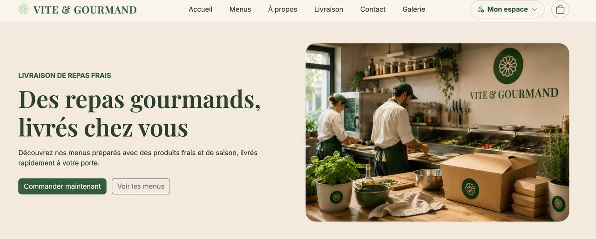

# 🍽️ Vite & Gourmand

Application web de livraison de repas développée avec Symfony 7 dans le cadre de l'Épreuve de Certification (ECF) du titre professionnel Développeur Web et Web Mobile.

---

## 📸 Aperçu de l'application



---

# Présentation

Vite & Gourmand est une plateforme de commande de repas permettant aux utilisateurs de découvrir des menus équilibrés, de passer commande en ligne et de suivre leurs commandes depuis un espace personnel sécurisé.

L'application a été développée dans le respect des bonnes pratiques Symfony en mettant l'accent sur :

- la sécurité ;
- la gestion des rôles ;
- l'expérience utilisateur ;
- la validation des données ;
- une architecture MVC claire ;
- des tests unitaires.

L'application possède également un espace Employé et un espace Administrateur permettant la gestion complète de l'activité du restaurant.

---

# Fonctionnalités

## 👤 Visiteur

- Consultation des menus disponibles
- Consultation des détails des menus
- Filtrage dynamique des menus
- Consultation des plats
- Création d'un compte
- Connexion
- Consultation des pages publiques
- Formulaire de contact

---

## 👥 Client

- Authentification sécurisée
- Consultation de son profil
- Modification des informations personnelles
- Modification du mot de passe
- Création d'une commande
- Suivi des commandes
- Modification d'une commande (selon son statut)
- Annulation d'une commande
- Consultation du motif d'annulation
- Dépôt d'un avis après une commande terminée

---

## 👨‍🍳 Employé

- Gestion des commandes
- Modification des statuts
- Validation ou refus des avis
- Gestion des menus
- Gestion des plats
- Gestion des horaires
- Gestion des conditions des menus
- Annulation d'une commande avec motif personnalisé

---

## 👑 Administrateur

Toutes les fonctionnalités Employé, plus :

- Gestion des comptes employés
- Création de nouveaux employés
- Désactivation des comptes employés
- Consultation des statistiques
- Chiffre d'affaires par menu
- Statistiques des commandes
- Consultation des données MongoDB

---

# Technologies utilisées

## Front-end

- HTML5
- CSS3
- Bootstrap 5
- JavaScript
- Twig

## Back-end

- PHP 8.2
- Symfony 7
- Doctrine ORM

## Bases de données

- MariaDB / MySQL
- MongoDB Atlas

## Tests

- PHPUnit

## Outils

- Composer
- Git
- GitHub
- Symfony CLI
- XAMPP
- Visual Studio Code
- PhpMyAdmin
- MongoDB Atlas

---

# Architecture
Symfony
│
├── Controller
├── Entity
├── Repository
├── Form
├── Service
├── Security
├── EventSubscriber
├── Command
├── Templates (Twig)
├── Public
└── Tests---

# Installation

## 1. Cloner le dépôt
git clone https://github.com/Aliya166/ecf-vite-gourmand.git---

## 2. Installer les dépendances
composer install---

## 3. Configurer les variables d'environnement

Créer un fichier :
.env.localExemple :
APP_ENV=dev
APP_SECRET=

DATABASE_URL=

MAILER_DSN=

MONGODB_URI=
MONGODB_DB=---

## 4. Créer la base de données
php bin/console doctrine:database:create---

## 5. Exécuter les migrations
php bin/console doctrine:migrations:migrate---

## 6. Charger les données (optionnel)
php bin/console doctrine:fixtures:load---

## 7. Lancer le serveur
Démarrer le serveur PHP:

```bash
php -S localhost:8000 -t public
````
Puis ouvrir le navigateur à l'adresse:

````
http://localhost:8000
```

# Tests PHPUnit

Lancer tous les tests :
php bin/phpunit---

# Sécurité

L'application implémente plusieurs mécanismes de sécurité :

- Authentification Symfony Security
- Hashage des mots de passe
- Protection CSRF
- Contrôle des rôles
- Validation des formulaires
- Gestion des accès par rôle
- Protection contre les accès non autorisés
- Validation des fichiers uploadés

---

# Bases de données

## MySQL

Stockage principal :

- utilisateurs
- commandes
- menus
- plats
- horaires
- avis

## MongoDB Atlas

Stockage des statistiques :

- nombre de commandes
- chiffre d'affaires
- menus les plus vendus
- statistiques d'activité

---

# Auteur

Alisa Zamkova

Projet réalisé dans le cadre de l'Épreuve de Certification (ECF)
du titre professionnel

Développeur Web et Web Mobile

2026

---

# Licence

Projet réalisé uniquement dans un cadre pédagogique.

Tous droits réservés.